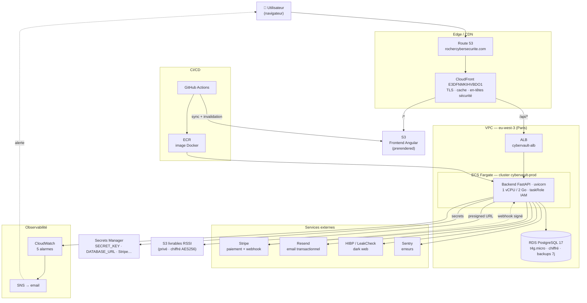
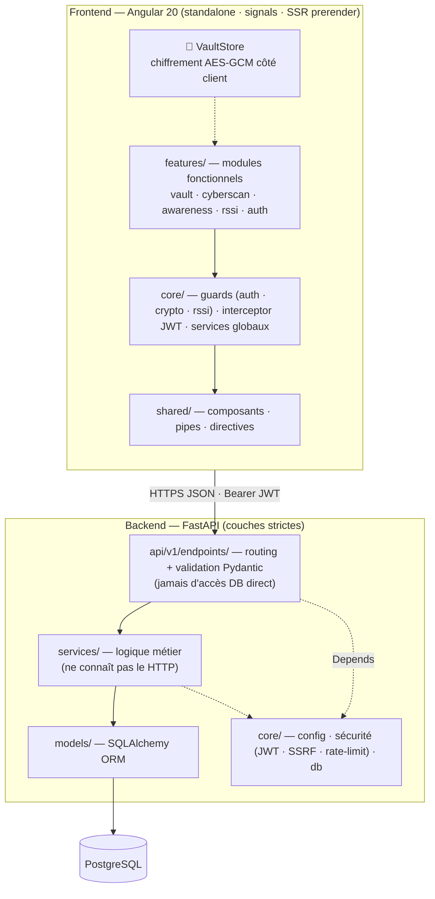
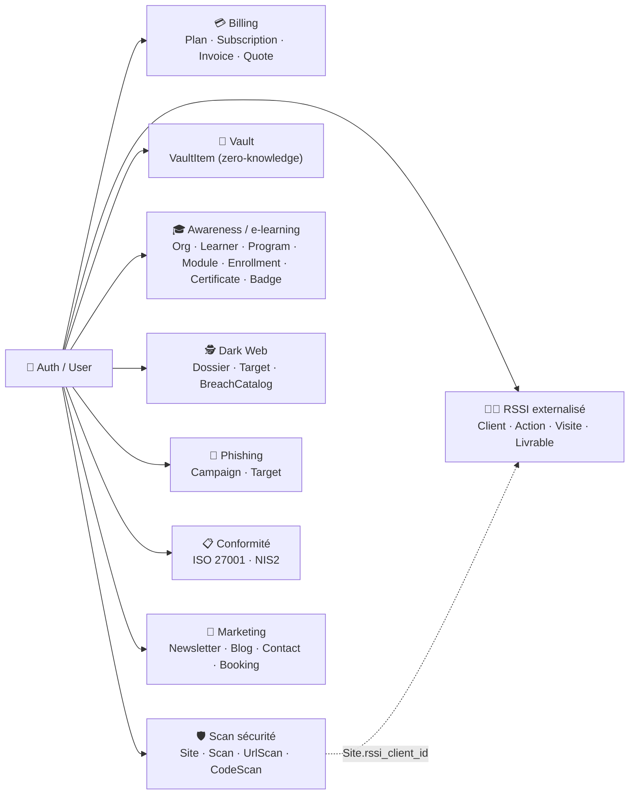
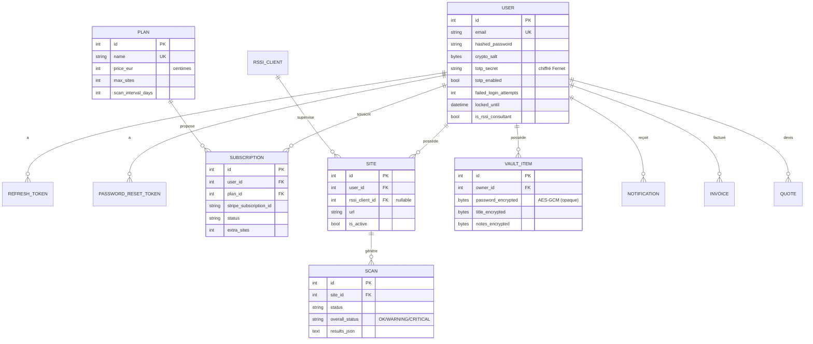
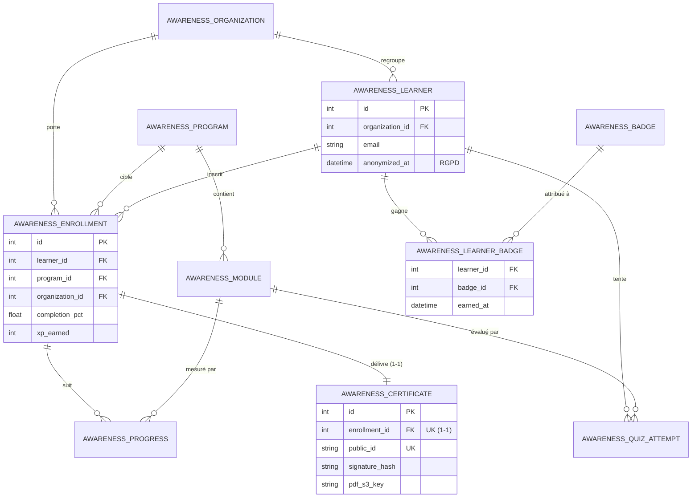
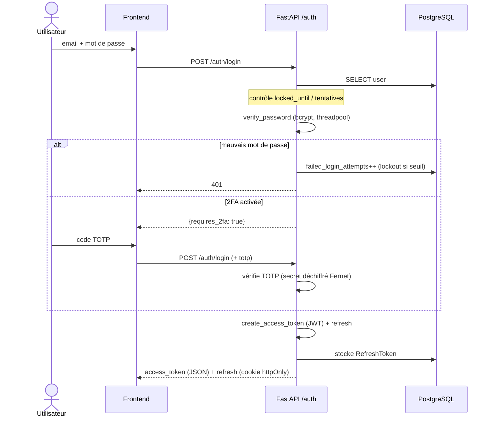
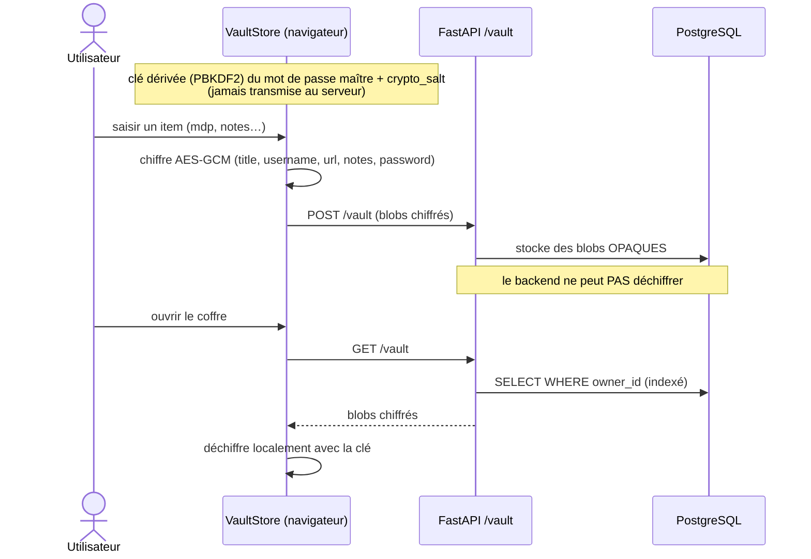
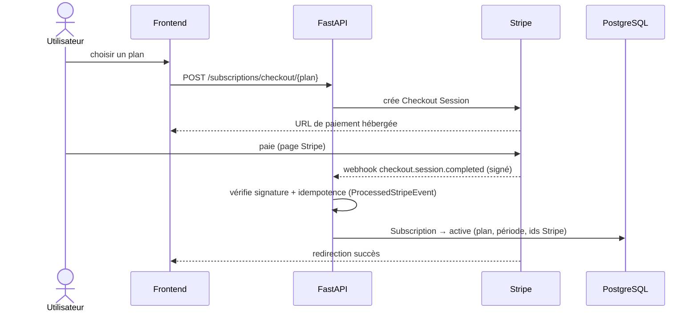
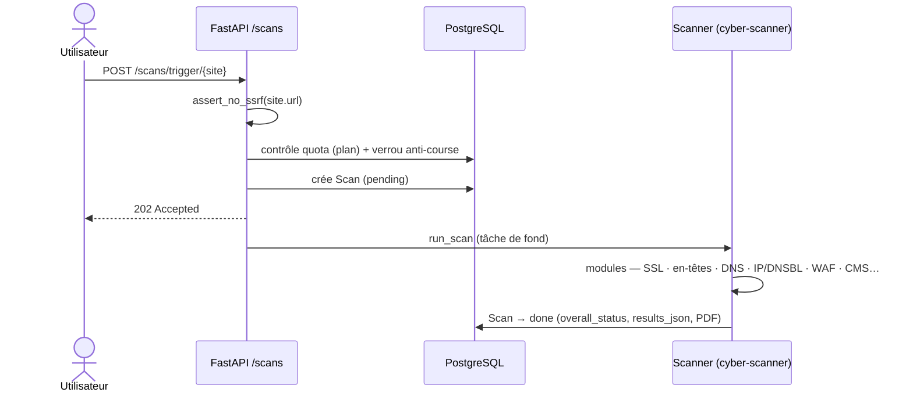

# Architecture technique — Cyber-Vault / Rocher Cybersécurité

> Documentation technique : architecture système (AWS), architecture applicative (couches),
> modèle de données (UML / entité-relation) et diagrammes de séquence des flux clés.
> Diagrammes en [Mermaid](https://mermaid.js.org) (rendu natif sur GitHub).

## Stack

| Couche | Technologies |
|---|---|
| **Frontend** | Angular 20 (standalone, signals), SSR/prerendering statique, Vitest, Playwright |
| **Backend** | FastAPI 0.138 · Starlette 1.3 · SQLAlchemy 2.0 async · Pydantic · PostgreSQL 17 |
| **Sécurité** | JWT (PyJWT) · 2FA TOTP (chiffré Fernet) · vault AES-GCM 256 zero-knowledge (clé PBKDF2) · anti-SSRF · slowapi · bcrypt |
| **Infra** | AWS ECS Fargate (1 vCPU / 2 Go) · RDS PostgreSQL (t4g.micro) · S3 · CloudFront · Route 53 · Secrets Manager · CloudWatch/SNS — région eu-west-3 |
| **CI/CD** | GitHub Actions → ECR → ECS ; gates couverture + 0 CVE (pip-audit / npm audit) |
| **Externes** | Stripe · Resend · Have I Been Pwned / LeakCheck · Sentry |

Volume : ~88 000 lignes de code hors tests (backend ~34k · frontend ~47k · scanner ~7k).

---

## 1. Architecture système (déploiement AWS)

Frontend statique servi par CloudFront/S3 ; API dynamique routée vers ECS Fargate derrière un ALB.
Le conteneur backend s'authentifie à AWS via un **rôle de tâche IAM** (`cybervault-ecs-task-role`).

**Points clés :** TLS terminé par CloudFront ; en-têtes de sécurité posés au CDN (HSTS, X-Frame-Options, nosniff…) ; RDS chiffrée + backups 7 jours ; secrets jamais en clair (Secrets Manager) ; déploiement immuable via image ECR + `alembic upgrade head` avant bascule + `wait services-stable` (anti-rollback silencieux).

---

## 2. Architecture applicative (couches)

Séparation stricte des responsabilités côté backend ; chiffrement du coffre effectué **côté client**.

**Règles :** les endpoints délèguent toujours aux services (aucun accès DB direct) ; les services ignorent les schémas HTTP ; l'authentification passe par `Depends(get_current_user)` ; toute URL fournie par l'utilisateur passe par `assert_no_ssrf()`.

**Modules fonctionnels :** Scanner vulnérabilités · Dark Web · Phishing (simulation) · RSSI externalisé · Sensibilisation NIS2 (e-learning) · Code Scan · Conformité ISO 27001 / NIS2 · Vault zero-knowledge.

---

## 3. Modèle de données

51 entités réparties en domaines fonctionnels. Vue d'ensemble puis détail des deux plus structurants.

### 3.1 Carte des domaines

### 3.2 Cœur — Utilisateur, facturation, scan, vault

### 3.3 Awareness / e-learning (domaine le plus riche)

Contient l'unique relation **N-N** (Learner ↔ Badge via l'objet d'association `AwarenessLearnerBadge`)
et une relation **1-1** (Enrollment ↔ Certificate).

> **11 énumérations** (`enums.py`) : ScanStatus, SubscriptionStatus, EnrollmentStatus, ProgressStatus,
> DossierStatus, ComplianceStatus, QuoteStatus, InvoiceStatus, CampaignStatus, FindingStatusEnum, CollabStatus.

---

## 4. Diagrammes de séquence (flux clés)

### 4.1 Authentification (login + 2FA + JWT)

### 4.2 Vault zero-knowledge (chiffrement côté client)

### 4.3 Abonnement Stripe (checkout + webhook)

### 4.4 Scan de sécurité (déclenchement + anti-SSRF)

---

*Diagrammes générés depuis le code source (modèles, endpoints, services).
Régénérer les images PNG/SVG : `bash docs/render-diagrams.sh` (nécessite `@mermaid-js/mermaid-cli`).
Voir aussi [DEPLOY.md](DEPLOY.md) et [SCALING.md](SCALING.md).*
